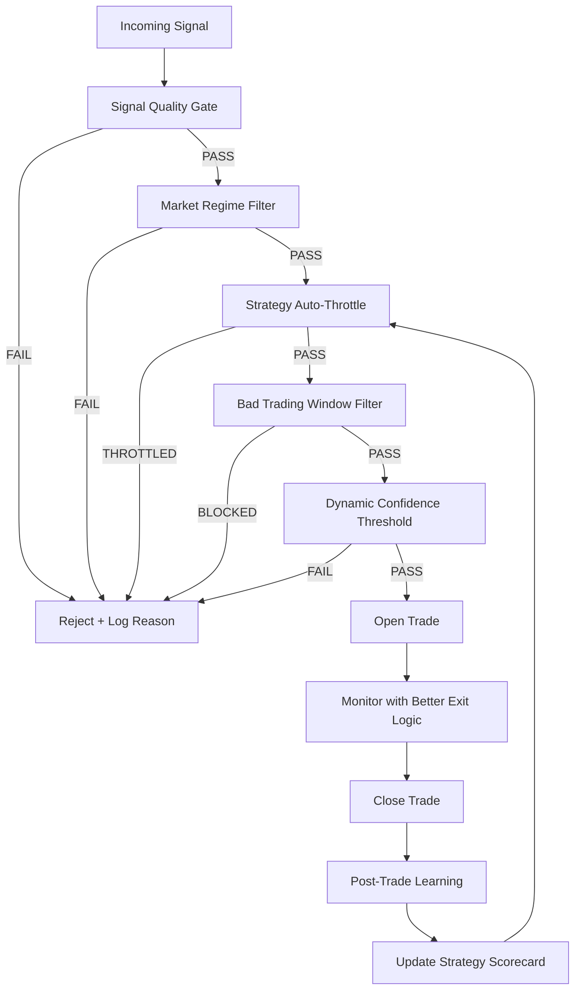

# Mock Trader Quality Improvements — Architecture Plan
## Date: 2026-05-06
## Author: Architect Mode

---

## 1. Current State Analysis

### Existing Architecture

| Component | File | Responsibility |
|---|---|---|
| Signal Engine | `lib/signal-engine.js` | EMA Cross, RSI Bounce, Volume Filter strategies. Generates signals with `confidence` 0.65-0.72. Social intel boost. |
| Probability Engine | `lib/scoring/probability-engine.js` | 6-factor scoring (market, liquidation, social, funding/OI, liquidity, strategy history). `finalProbability` output. |
| Mock Account Engine | `lib/mock-trading/mock-account-engine.js` | Basic paper account. Opens trades at `finalProbability >= threshold`. |
| Execution Engine v3 | `lib/mock-trading/execution-engine.js` | Advanced execution with ML boost, TV confluence, RL portfolio state, Kelly sizing, trailing stops, breakeven SL. |
| Aggressive Engine | `lib/mock-trading/aggressive-engine.js` | Perpetual trading with adaptive leverage (Bayesian-like), tight stops, TV scan. |
| Aggressive Worker | `workers/aggressive-mock-worker.js` | 90s tick: close existing → fetch signals (confidence >= 0.55, <30min old) → open trades → TV scan. |
| Dashboard API | `api/mock-trading-dashboard.js` | Returns account, open/closed trades, strategyStats (trades, wins, losses, winRate, totalPnl, avgReturn, best/worst). |
| Mock Trades Table | `supabase/trading_schema.sql` | `mock_trades` with columns for entry, exit, pnl, strategy_name, score_breakdown (JSONB), metadata (JSONB). |
| Trade History | `lib/mock-trading/trade-history.js` | Logs open/close events to `mock_trade_history`. |

### Key Problems Identified

1. **Low signal quality threshold**: `aggressive-mock-worker.js` opens signals at `confidence >= 0.55`, no R/R check, no confluence requirement.
2. **No market regime awareness**: Same strategy trades identically in chop vs trend vs news.
3. **No per-strategy-symbol-timeframe tracking**: Strategy stats exist but only at strategy-level, not symbol/timeframe/regime granularity.
4. **Static confidence threshold**: `finalProbability >= 65` is fixed regardless of recent performance.
5. **Limited post-trade learning**: Only records `recordOutcome()` to pattern-learner. No MFE/MAE/time-in-trade.
6. **Exit logic gaps**: No partial TP, no time stop after N candles, trailing stop activates too early.
7. **No bad trading window filter**: Trades around news spikes, extreme funding, thin liquidity.
8. **No strategy throttling**: Bad combos keep trading. No auto-disable.
9. **Dashboard lacks leaderboard**: Only basic strategyStats, no profit factor, avg R, sample size warnings.

---

## 2. Proposed Architecture

### Core Philosophy
> Focus on **signal quality over quantity**. Every trade must pass a multi-layer gate before execution. Bad performers are auto-throttled. The system learns from every close.



---

## 3. Feature Specifications

### 3.1 Signal Quality Gate (`lib/mock-trading/signal-quality-gate.js`)

**Purpose**: Reject low-quality signals before they reach execution.

**Rules** (ALL must pass):
- `confidence >= 0.65` (configurable via `SIGNAL_QUALITY_MIN_CONFIDENCE`)
- `risk/reward >= 1.5` (configurable via `SIGNAL_QUALITY_MIN_RR`)
- `signal age <= 5 minutes` for intraday timeframes (15m, 1h)
- `volume_above_recent_average` — check `volume_change_pct` in metadata
- `no_duplicate_open_position` on same symbol (any side)
- `max_concurrent_trades` not exceeded

**Input**: `signal` object + `context` (open trades, recent volume)
**Output**: `{ passed: boolean, reason?: string, score: number }`

**Integration**: Called by both `aggressive-mock-worker.js` and `execution-engine.js` before `openAggressiveTrade()` / `openExecution()`.

---

### 3.2 Market Regime Filter (`lib/mock-trading/market-regime-filter.js`)

**Purpose**: Label current market state and block unsuitable strategies.

**Regime Detection** (from OHLCV + ATR):
- `trending` — ADX > 25, clear directional price movement
- `ranging` — ADX < 20, price within Bollinger Bands middle zone
- `high_volatility` — ATR / price > 3% (15m), or recent wick size > 2%
- `news_risk` — Detected from `news_sentiment_score` spike or `signal_patterns` abnormal volume

**Strategy-Regime Mapping** (configurable):
| Strategy | trending | ranging | high_volatility | news_risk |
|---|---|---|---|---|
| EMA_Cross | ✅ | ❌ | ⚠️ (reduce size) | ❌ |
| RSI_Bounce | ⚠️ | ✅ | ❌ | ❌ |
| EMA_Cross_Volume | ✅ | ❌ | ✅ | ⚠️ |
| RSI_Bounce_Volume | ⚠️ | ✅ | ⚠️ | ❌ |
| tv_ta_scan | ✅ | ✅ | ⚠️ | ❌ |

**Input**: `symbol`, `ohlcv`, `signal.strategy`, `metadata`
**Output**: `{ regime: string, allowed: boolean, reason?: string, adjustment?: object }`

**Integration**: Called after Signal Quality Gate. If `allowed === false`, reject. If `adjustment`, modify signal (reduce size, raise SL).

---

### 3.3 Strategy Scorecard (`lib/mock-trading/strategy-scorecard.js`)

**Purpose**: Track rolling performance per `(strategy, symbol, timeframe, regime)` combo.

**Schema** (new table `strategy_scorecard`):
```sql
CREATE TABLE IF NOT EXISTS strategy_scorecard (
  id BIGSERIAL PRIMARY KEY,
  strategy_name TEXT NOT NULL,
  symbol TEXT NOT NULL,
  timeframe TEXT NOT NULL,
  market_regime TEXT DEFAULT 'any',
  total_trades INT DEFAULT 0,
  wins INT DEFAULT 0,
  losses INT DEFAULT 0,
  win_rate NUMERIC DEFAULT 0,
  profit_factor NUMERIC DEFAULT 0,
  avg_pnl_usd NUMERIC DEFAULT 0,
  avg_pnl_pct NUMERIC DEFAULT 0,
  avg_r NUMERIC DEFAULT 0,           -- average R-multiple
  max_drawdown_pct NUMERIC DEFAULT 0,
  max_favorable_excursion NUMERIC DEFAULT 0,
  max_adverse_excursion NUMERIC DEFAULT 0,
  avg_time_in_trade_minutes INT DEFAULT 0,
  last_trade_at TIMESTAMPTZ,
  is_throttled BOOLEAN DEFAULT FALSE,
  throttle_reason TEXT,
  throttle_until TIMESTAMPTZ,
  created_at TIMESTAMPTZ DEFAULT NOW(),
  updated_at TIMESTAMPTZ DEFAULT NOW(),
  UNIQUE(strategy_name, symbol, timeframe, market_regime)
);
CREATE INDEX IF NOT EXISTS idx_scorecard_strategy ON strategy_scorecard(strategy_name, symbol, timeframe);
CREATE INDEX IF NOT EXISTS idx_scorecard_throttled ON strategy_scorecard(is_throttled) WHERE is_throttled = TRUE;
```

**Metrics Computed** (rolling window: last 50 trades, minimum 5 for any stat):
- `win_rate` = wins / total_trades
- `profit_factor` = gross wins / |gross losses|
- `avg_r` = average R-multiple (PnL / initial risk)
- `max_drawdown_pct` = peak-to-trough in rolling window
- `sample_size_warning` = total_trades < 30 (shown in dashboard)

**Functions**:
- `recordTradeOutcome(scorecardKey, tradeResult)` — upserts scorecard row
- `getScorecard(strategy, symbol, timeframe, regime)` — reads current stats
- `getAllScorecards(filters)` — for dashboard leaderboard

---

### 3.4 Dynamic Confidence Thresholds (`lib/mock-trading/dynamic-confidence.js`)

**Purpose**: Adapt the minimum confidence required based on recent performance.

**Rules**:
- Base threshold: `0.65` (configurable)
- After 3 consecutive losses (same strategy-symbol combo): raise to `0.75`
- After 10+ consecutive profitable trades: lower slowly by `-0.02` per win (floor `0.60`)
- Low-liquidity pairs (volume rank bottom 20%): add `+0.05` to threshold
- High volatility regime: add `+0.03` to threshold

**State Storage**: `strategy_scorecard.dynamic_threshold` column (persistent) + in-memory cache.

**Input**: `strategy`, `symbol`, `timeframe`, `currentThreshold`
**Output**: `{ threshold: number, reason: string }`

**Integration**: Applied inside Signal Quality Gate as the effective `minConfidence`.

---

### 3.5 Post-Trade Learning (`lib/mock-trading/post-trade-learning.js`)

**Purpose**: After every closed trade, capture detailed analytics.

**Data Captured** (stored in `mock_trades.metadata` JSONB):
```json
{
  "postTrade": {
    "tpHitFirst": true,
    "slHitFirst": false,
    "maxFavorableExcursionPct": 2.4,
    "maxAdverseExcursionPct": -0.8,
    "timeInTradeMinutes": 45,
    "spreadEstimateBps": 5,
    "slippageEstimateBps": 3,
    "marketRegimeAtEntry": "trending",
    "entryQuality": "good",
    "exitQuality": "early",
    "rMultiple": 1.8,
    "initialRiskUsd": 120,
    "lessons": ["Held through first pullback", "SL too tight for volatility"]
  }
}
```

**Functions**:
- `analyzeClosedTrade(trade, priceHistory)` — computes MFE/MAE/time/regime
- `updateScorecardFromTrade(trade)` — writes to `strategy_scorecard`
- `generateLessons(trade)` — simple heuristics (e.g., "if MFE > 2R but closed at 0.5R, exit too early")

**Integration**: Called from `closeExecution()` and `closeAggressiveTrade()` before updating the account balance.

---

### 3.6 Better Exit Logic (`lib/mock-trading/exit-engine.js`)

**Purpose**: Improve win rate through smarter exits.

**Enhanced Rules**:
1. **Breakeven after +1R** (existing: after +0.5%) — move SL to `entry * 1.001` (long) once unrealized PnL >= initial risk
2. **Partial TP at 1R** — close 30% of position at 1R, let remainder run to main TP
3. **Trailing stop only after momentum confirms** — only activate trailing after price moves `+1.5R` in profit AND volume is above average
4. **Time stop** — if trade is open > N candles (config: 16 candles for 15m = 4h) and unrealized < 0.1R, close as "time_stop"
5. **Volatility-adjusted trailing** — in high volatility, use wider trailing pct; in low volatility, tighter

**Schema Update** (to `mock_trades`):
```sql
ALTER TABLE mock_trades ADD COLUMN IF NOT EXISTS partial_exit_price NUMERIC;
ALTER TABLE mock_trades ADD COLUMN IF NOT EXISTS partial_exit_pct NUMERIC DEFAULT 0; -- % of position closed early
ALTER TABLE mock_trades ADD COLUMN IF NOT EXISTS r_multiple_at_close NUMERIC;
ALTER TABLE mock_trades ADD COLUMN IF NOT EXISTS initial_risk_usd NUMERIC;
```

**Functions**:
- `monitorExitsWithEnhancedLogic(openTrade)` — replaces current monitor logic
- `shouldMoveToBreakeven(trade, currentPrice)` — checks +1R condition
- `shouldTakePartialProfit(trade, currentPrice)` — checks 1R partial condition
- `shouldActivateTrailing(trade, currentPrice, volumeContext)` — momentum + distance check

**Integration**: Replace `monitorExecutions()` in execution-engine and `monitorAndCloseAggressive()` in aggressive-engine with calls to exit-engine.

---

### 3.7 Bad Trading Windows Filter (`lib/mock-trading/trading-window-filter.js`)

**Purpose**: Block new entries during dangerous market conditions.

**Block Conditions** (any one triggers block):
1. **Major news spike** — `news_sentiment_score` abs > 0.8 in last 10 min
2. **Extreme funding rate** — `funding_rate` annualized > 100% or < -100%
3. **Thin liquidity** — `volume_change_pct` < -50% vs 24h average AND spread > 20 bps
4. **Post-liquidation cascade** — detected if `liq_risk_score` > 80 in last 30 min (only block mean-reversion strategies; allow breakout strategies)
5. **Weekend low liquidity** — Saturday 00:00-04:00 UTC for altcoins (optional/configurable)

**Input**: `symbol`, `signal`, `marketContext` (funding, volume, liq, news)
**Output**: `{ allowed: boolean, reason?: string, windowType?: string }`

**Integration**: Called after Market Regime Filter, before Dynamic Confidence check.

---

### 3.8 Strategy Leaderboard (Dashboard Enhancement)

**Purpose**: Show strategy performance in dashboard with sample size warnings.

**API Enhancement** (`api/mock-trading-dashboard.js`):
Add `scorecard` array to response:
```json
{
  "scorecard": [
    {
      "strategy": "EMA_Cross",
      "symbol": "BTCUSDT",
      "timeframe": "15m",
      "regime": "trending",
      "totalTrades": 47,
      "winRate": 0.58,
      "profitFactor": 1.42,
      "avgR": 0.82,
      "maxDrawdownPct": 12.3,
      "sampleSizeWarning": true,
      "isThrottled": false,
      "status": "active"
    }
  ]
}
```

**UI Enhancement** (`public/index.html` — Mock Trading tab):
- New "Strategy Leaderboard" card below existing stats
- Columns: Strategy | Symbol | TF | Trades | Win Rate | Profit Factor | Avg R | Status
- Color coding: green = good, yellow = sample_size < 30, red = throttled
- Click row → show detail (last 20 trades, regime breakdown)

---

### 3.9 Strategy Auto-Throttle (Highest Priority)

**Purpose**: Automatically pause bad strategy + symbol + timeframe + regime combos.

**Throttle Rules**:
- Trigger: `win_rate < 0.45` AND `total_trades >= 10` over last 30 trades
- OR: `profit_factor < 1.0` AND `total_trades >= 10`
- OR: `avg_r < 0` AND `total_trades >= 15`
- OR: `max_drawdown_pct > 20` AND `total_trades >= 10`

**Action**:
- `is_throttled = TRUE`
- `throttle_reason = "Win rate 42% below 45% threshold"`
- `throttle_until = NOW() + 24 hours` (configurable)
- Log to `learning_feedback_log` as `config_updated` event

**Unthrottle Rules**:
- After `throttle_until` expires, allow ONE test trade
- If test trade wins, unthrottle
- If test trade loses, extend throttle by 24h

**Integration**:
- Check in `Strategy Auto-Throttle` module before opening any trade
- Read `strategy_scorecard.is_throttled` for the combo
- If throttled and `throttle_until > NOW()`, reject
- If throttle expired, allow test trade with reduced size (50%)

---

## 4. Implementation Order

| Phase | Feature | Files to Create/Modify | Risk Level |
|---|---|---|---|
| 1 | Strategy Scorecard (schema + lib) | `supabase/mock-trader-improvements.sql`, `lib/mock-trading/strategy-scorecard.js` | Low |
| 1 | Post-Trade Learning | `lib/mock-trading/post-trade-learning.js` | Low |
| 2 | Signal Quality Gate | `lib/mock-trading/signal-quality-gate.js` | Medium |
| 2 | Market Regime Filter | `lib/mock-trading/market-regime-filter.js` | Medium |
| 3 | Strategy Auto-Throttle | Modify `strategy-scorecard.js`, integrate into workers | Medium |
| 3 | Dynamic Confidence | `lib/mock-trading/dynamic-confidence.js` | Medium |
| 4 | Bad Trading Windows | `lib/mock-trading/trading-window-filter.js` | Low |
| 4 | Better Exit Logic | `lib/mock-trading/exit-engine.js`, modify engines | High |
| 5 | Dashboard Leaderboard | `api/mock-trading-dashboard.js`, `public/index.html` | Low |
| 6 | Integration + Tests | Worker integration, unit tests | Medium |

---

## 5. New Files

```
lib/mock-trading/
├── signal-quality-gate.js      # NEW — multi-factor signal validation
├── market-regime-filter.js     # NEW — ADX/ATR-based regime detection
├── strategy-scorecard.js       # NEW — rolling performance tracking
├── dynamic-confidence.js       # NEW — adaptive threshold management
├── post-trade-learning.js      # NEW — MFE/MAE/lesson extraction
├── exit-engine.js              # NEW — enhanced exit logic (partial TP, time stop, etc.)
├── trading-window-filter.js    # NEW — block bad trading windows

supabase/
└── mock-trader-improvements.sql # NEW — schema for scorecard, columns, indexes

workers/
└── strategy-throttle-worker.js  # NEW — periodic throttle check/unthrottle (optional)
```

## 6. Modified Files

```
lib/mock-trading/
├── execution-engine.js          # MOD — integrate gates, exit-engine, post-trade learning
├── aggressive-engine.js         # MOD — integrate gates, exit-engine, post-trade learning
├── mock-account-engine.js       # MOD — minor: pass metadata through

traders/
├── aggressive-mock-worker.js    # MOD — call signal-quality-gate, regime-filter, throttle before open

api/
├── mock-trading-dashboard.js    # MOD — add scorecard to response

public/
└── index.html                   # MOD — add Strategy Leaderboard to Mock Trading tab
```

---

## 7. Key Design Decisions

1. **All gates are opt-in via config**: `ENABLE_SIGNAL_QUALITY_GATE`, `ENABLE_MARKET_REGIME_FILTER`, etc. Default = `true` for paper mode.
2. **Scorecard is the central state**: All features read/write scorecard. It becomes the single source of truth for strategy health.
3. **Paper mode never blocks entirely**: Gates can `warn` in paper mode but still allow trade for learning. Config: `GATE_PAPER_MODE = 'warn'` vs `'block'`.
4. **Throttle is strategy+symbol+timeframe+regime**: Granular enough to disable bad combos without killing a whole strategy.
5. **Minimum sample size = 10 for throttle, 30 for dashboard trust**: Prevents premature throttling from variance.
6. **Exit engine is pluggable**: Existing monitor logic stays as fallback if `ENABLE_ENHANCED_EXITS = false`.

---

## 8. Rollback Plan

- All features gated by env vars. Set `ENABLE_* = false` to disable instantly.
- Scorecard table does not affect existing trades (write-only analytics).
- Enhanced exits can fall back to old monitor logic via config.
- If throttle is too aggressive, raise `THROTTLE_MIN_TRADES` from 10 to 20.
