# Self-Improving Trading Signal Bot — Architecture Plan

## Project: xsjprd55
## Date: 2026-04-26
## Scope: Pattern learning, App Suggestions, Data Source Registry, Learning Loop

---

## 1. Database Schema Additions

### 1.1 `signal_patterns` — Pattern Learning from Historical Signals

Stores extracted features from every signal at generation time for ML-style analysis.

```sql
CREATE TABLE signal_patterns (
  id UUID PRIMARY KEY DEFAULT gen_random_uuid(),
  signal_id UUID REFERENCES signals(id) ON DELETE CASCADE,
  
  -- Signal metadata
  symbol TEXT NOT NULL,
  side TEXT NOT NULL CHECK (side IN ('LONG','SHORT','CLOSE')),
  strategy TEXT NOT NULL,
  timeframe TEXT NOT NULL,
  confidence DECIMAL(4,3) NOT NULL,
  source TEXT NOT NULL,
  generated_at TIMESTAMPTZ NOT NULL,
  
  -- Market snapshot at signal time
  market_price DECIMAL(18,8),
  market_change_24h DECIMAL(8,4),
  market_volume_24h DECIMAL(24,4),
  market_rsi_14 DECIMAL(6,2),
  market_ema_9 DECIMAL(18,8),
  market_ema_21 DECIMAL(18,8),
  market_vol_spike DECIMAL(6,2),
  
  -- Liquidation snapshot at signal time
  liq_funding_annualized DECIMAL(8,4),
  liq_open_interest_usd DECIMAL(24,2),
  liq_risk_score INTEGER CHECK (liq_risk_score BETWEEN 0 AND 100),
  
  -- News snapshot at signal time
  news_sentiment_score DECIMAL(4,3),
  news_count_1h INTEGER DEFAULT 0,
  news_bullish_count INTEGER DEFAULT 0,
  news_bearish_count INTEGER DEFAULT 0,
  
  -- Global market snapshot
  global_btc_dominance DECIMAL(6,2),
  global_fear_greed DECIMAL(6,2),
  global_total_mcap_usd DECIMAL(24,2),
  
  -- Outcome (filled later when trade closes or signal expires)
  outcome TEXT CHECK (outcome IN ('win','loss','breakeven','expired','pending')),
  outcome_pnl DECIMAL(12,4),
  outcome_reached_tp BOOLEAN DEFAULT FALSE,
  outcome_reached_sl BOOLEAN DEFAULT FALSE,
  outcome_duration_minutes INTEGER,
  outcome_filled_at TIMESTAMPTZ,
  
  -- Feature vector (JSONB for extensibility)
  feature_vector JSONB DEFAULT '{}',
  
  -- Indexes
  CONSTRAINT fk_signal FOREIGN KEY (signal_id) REFERENCES signals(id)
);

CREATE INDEX idx_signal_patterns_symbol ON signal_patterns(symbol);
CREATE INDEX idx_signal_patterns_strategy ON signal_patterns(strategy);
CREATE INDEX idx_signal_patterns_outcome ON signal_patterns(outcome) WHERE outcome IS NOT NULL;
CREATE INDEX idx_signal_patterns_generated ON signal_patterns(generated_at);
CREATE INDEX idx_signal_patterns_feature ON signal_patterns USING GIN(feature_vector);
```

### 1.2 `app_suggestions` — Bot-Generated Improvement Suggestions

```sql
CREATE TABLE app_suggestions (
  id UUID PRIMARY KEY DEFAULT gen_random_uuid(),
  
  -- Suggestion classification
  category TEXT NOT NULL CHECK (category IN (
    'new_api',           -- Add a new data source/API
    'new_strategy',      -- New trading strategy
    'strategy_tweak',    -- Modify existing strategy parameters
    'new_data_source',   -- New exchange/news source
    'ui_improvement',    -- Dashboard/Telegram UI change
    'risk_adjustment',   -- Risk gate change
    'tool_discovery',    -- New tool/library discovered
    'correction'         -- Fix something that's underperforming
  )),
  
  -- Suggestion content
  title TEXT NOT NULL,
  description TEXT NOT NULL,
  rationale TEXT NOT NULL,        -- Why the bot thinks this helps
  expected_impact TEXT,           -- Expected win-rate, latency, coverage improvement
  implementation_hint TEXT,       -- Rough steps or code hints
  suggested_config JSONB DEFAULT '{}',
  
  -- Evidence (what data triggered this suggestion)
  evidence JSONB DEFAULT '{}',
  -- Example: {"pattern_count": 150, "win_rate_without": 0.42, "win_rate_with": 0.68, "confidence": 0.85}
  
  -- Status workflow
  status TEXT NOT NULL DEFAULT 'pending' CHECK (status IN ('pending','under_review','approved','rejected','implemented','deferred')),
  
  -- User interaction
  user_vote INTEGER DEFAULT 0 CHECK (user_vote BETWEEN -1 AND 1),
  user_notes TEXT,
  admin_notes TEXT,
  
  -- Tracking
  generated_at TIMESTAMPTZ DEFAULT now(),
  reviewed_at TIMESTAMPTZ,
  implemented_at TIMESTAMPTZ,
  reviewed_by TEXT,
  
  -- Source traceability
  source_module TEXT NOT NULL,    -- e.g. 'pattern-learner', 'market-scanner', 'news-analyzer'
  source_version TEXT             -- app version or commit hash
);

CREATE INDEX idx_app_suggestions_status ON app_suggestions(status);
CREATE INDEX idx_app_suggestions_category ON app_suggestions(category);
CREATE INDEX idx_app_suggestions_generated ON app_suggestions(generated_at);
```

### 1.3 `data_source_registry` — Registry of Connected Data Sources

```sql
CREATE TABLE data_source_registry (
  id UUID PRIMARY KEY DEFAULT gen_random_uuid(),
  
  -- Identity
  name TEXT NOT NULL UNIQUE,           -- e.g. 'okx_perp', 'hyperliquid', 'cointelegraph_rss'
  display_name TEXT NOT NULL,
  type TEXT NOT NULL CHECK (type IN (
    'exchange_rest', 'exchange_ws', 'news_rss', 'news_api',
    'onchain', 'social', 'sentiment', 'macro', 'custom'
  )),
  
  -- Configuration
  base_url TEXT,
  api_endpoint TEXT,
  auth_type TEXT CHECK (auth_type IN ('none','api_key','bearer','oauth','webhook_secret')),
  config JSONB DEFAULT '{}',           -- Endpoint-specific settings
  
  -- Capabilities (what this source provides)
  provides JSONB DEFAULT '[]',         -- ["price", "volume", "funding", "oi", "news", "liquidation"]
  supported_symbols JSONB DEFAULT '[]', -- ["BTCUSDT", "ETHUSDT"]
  rate_limit JSONB DEFAULT '{}',       -- {"requests_per_min": 60, "burst": 10}
  
  -- Health tracking
  status TEXT NOT NULL DEFAULT 'active' CHECK (status IN ('active','degraded','down','disabled','experimental')),
  last_success_at TIMESTAMPTZ,
  last_error_at TIMESTAMPTZ,
  last_error_message TEXT,
  avg_latency_ms INTEGER,
  reliability_score DECIMAL(4,3) DEFAULT 1.0,  -- 0-1 based on recent success rate
  
  -- Usage metrics
  requests_count INTEGER DEFAULT 0,
  signals_contributed INTEGER DEFAULT 0,
  
  -- Metadata
  discovered_by TEXT DEFAULT 'manual', -- 'manual', 'pattern-learner', 'suggestion-bot'
  discovered_at TIMESTAMPTZ DEFAULT now(),
  docs_url TEXT,
  notes TEXT
);

CREATE INDEX idx_data_source_type ON data_source_registry(type);
CREATE INDEX idx_data_source_status ON data_source_registry(status);
CREATE INDEX idx_data_source_provides ON data_source_registry USING GIN(provides);
```

### 1.4 `learning_feedback_log` — Feedback Loop Audit Trail

```sql
CREATE TABLE learning_feedback_log (
  id UUID PRIMARY KEY DEFAULT gen_random_uuid(),
  
  -- What was learned
  event_type TEXT NOT NULL CHECK (event_type IN (
    'pattern_extracted',
    'outcome_recorded',
    'suggestion_generated',
    'suggestion_reviewed',
    'config_updated',
    'new_source_discovered',
    'strategy_backtested',
    'model_retrained'
  )),
  
  -- References
  signal_id UUID REFERENCES signals(id) ON DELETE SET NULL,
  suggestion_id UUID REFERENCES app_suggestions(id) ON DELETE SET NULL,
  source_id UUID REFERENCES data_source_registry(id) ON DELETE SET NULL,
  
  -- Details
  module TEXT NOT NULL,              -- Which module generated this event
  data JSONB DEFAULT '{}',
  
  -- Metrics
  before_state JSONB,                -- State before learning
  after_state JSONB,                 -- State after learning
  improvement_metric DECIMAL(8,4),   -- Quantified improvement if applicable
  
  created_at TIMESTAMPTZ DEFAULT now()
);

CREATE INDEX idx_learning_feedback_module ON learning_feedback_log(module);
CREATE INDEX idx_learning_feedback_event ON learning_feedback_log(event_type);
CREATE INDEX idx_learning_feedback_created ON learning_feedback_log(created_at);
```

### 1.5 `strategy_performance` — Rolling Performance by Strategy + Market Condition

```sql
CREATE TABLE strategy_performance (
  id UUID PRIMARY KEY DEFAULT gen_random_uuid(),
  
  strategy TEXT NOT NULL,
  timeframe TEXT NOT NULL,
  symbol TEXT,                       -- NULL = aggregate across symbols
  
  -- Market condition filter
  market_regime TEXT CHECK (market_regime IN ('bull','bear','range','volatile','any')),
  btc_dominance_range TEXT,          -- e.g. "40-50" for filtering
  
  -- Stats
  total_signals INTEGER DEFAULT 0,
  win_count INTEGER DEFAULT 0,
  loss_count INTEGER DEFAULT 0,
  expired_count INTEGER DEFAULT 0,
  avg_pnl DECIMAL(12,4),
  avg_confidence DECIMAL(4,3),
  win_rate DECIMAL(4,3),
  sharpe_like DECIMAL(6,3),          -- win_rate / std_dev of outcomes
  
  -- Time window
  window_start TIMESTAMPTZ NOT NULL,
  window_end TIMESTAMPTZ NOT NULL,
  
  -- Suggestion linkage
  suggested_tweak JSONB,             -- What the bot suggests to improve
  
  UNIQUE(strategy, timeframe, symbol, market_regime, window_start)
);

CREATE INDEX idx_strategy_perf_strategy ON strategy_performance(strategy);
CREATE INDEX idx_strategy_perf_window ON strategy_performance(window_start, window_end);
```

---

## 2. New Library Modules

### 2.1 `lib/pattern-learner.js`

Extracts patterns from signals and records outcomes for learning.

```javascript
// ============================================================
// Pattern Learner — Extracts feature vectors from signals
// and records outcomes for continuous learning
// ============================================================

import { supabase } from './supabase.js';

/**
 * Extract a feature vector from market context at signal time.
 * @param {Object} signal - The generated signal
 * @param {Object} marketCtx - { price, change24h, volume, rsi, ema9, ema21, volSpike }
 * @param {Object} liqCtx - { fundingAnnualized, openInterestUsd, riskScore }
 * @param {Object} newsCtx - { sentimentScore, bullishCount, bearishCount }
 * @param {Object} globalCtx - { btcDominance, fearGreed, totalMcap }
 * @returns {Object} patternRecord
 */
export async function extractPattern(signal, marketCtx, liqCtx, newsCtx, globalCtx) {
  const pattern = {
    signal_id: signal.id,
    symbol: signal.symbol,
    side: signal.side,
    strategy: signal.strategy,
    timeframe: signal.timeframe,
    confidence: signal.confidence,
    source: signal.source,
    generated_at: signal.generated_at,
    
    market_price: marketCtx?.price,
    market_change_24h: marketCtx?.change24h,
    market_volume_24h: marketCtx?.volume24h,
    market_rsi_14: marketCtx?.rsi,
    market_ema_9: marketCtx?.ema9,
    market_ema_21: marketCtx?.ema21,
    market_vol_spike: marketCtx?.volSpike,
    
    liq_funding_annualized: liqCtx?.fundingAnnualized,
    liq_open_interest_usd: liqCtx?.openInterestUsd,
    liq_risk_score: liqCtx?.riskScore,
    
    news_sentiment_score: newsCtx?.sentimentScore,
    news_count_1h: newsCtx?.count1h,
    news_bullish_count: newsCtx?.bullishCount,
    news_bearish_count: newsCtx?.bearishCount,
    
    global_btc_dominance: globalCtx?.btcDominance,
    global_fear_greed: globalCtx?.fearGreed,
    global_total_mcap_usd: globalCtx?.totalMcapUsd,
    
    feature_vector: buildFeatureVector(marketCtx, liqCtx, newsCtx, globalCtx),
    outcome: 'pending'
  };
  
  const { data, error } = await supabase
    .from('signal_patterns')
    .insert(pattern)
    .select()
    .single();
    
  if (error) throw error;
  return data;
}

/**
 * Record the outcome of a signal after it resolves.
 * @param {string} signalId
 * @param {Object} outcome - { pnl, reachedTp, reachedSl, durationMinutes }
 */
export async function recordOutcome(signalId, outcome) {
  const { data: pattern } = await supabase
    .from('signal_patterns')
    .select('*')
    .eq('signal_id', signalId)
    .single();
    
  if (!pattern) return;
  
  let outcomeLabel = 'pending';
  if (outcome.pnl > 0) outcomeLabel = 'win';
  else if (outcome.pnl < 0) outcomeLabel = 'loss';
  else if (outcome.pnl === 0) outcomeLabel = 'breakeven';
  else outcomeLabel = 'expired';
  
  await supabase
    .from('signal_patterns')
    .update({
      outcome: outcomeLabel,
      outcome_pnl: outcome.pnl,
      outcome_reached_tp: outcome.reachedTp,
      outcome_reached_sl: outcome.reachedSl,
      outcome_duration_minutes: outcome.durationMinutes,
      outcome_filled_at: new Date().toISOString()
    })
    .eq('signal_id', signalId);
    
  await logLearningEvent('outcome_recorded', { signal_id: signalId, outcome: outcomeLabel, pnl: outcome.pnl });
}

/**
 * Build a normalized feature vector for pattern comparison.
 */
function buildFeatureVector(marketCtx, liqCtx, newsCtx, globalCtx) {
  return {
    // Normalized features 0-1 or -1 to +1
    rsi_norm: marketCtx?.rsi ? marketCtx.rsi / 100 : null,
    change_norm: marketCtx?.change24h ? Math.max(-1, Math.min(1, marketCtx.change24h / 20)) : null,
    funding_norm: liqCtx?.fundingAnnualized ? Math.max(-1, Math.min(1, liqCtx.fundingAnnualized / 300)) : null,
    oi_log: liqCtx?.openInterestUsd ? Math.log10(liqCtx.openInterestUsd + 1) / 12 : null,
    sentiment_norm: newsCtx?.sentimentScore || 0,
    news_density: newsCtx?.count1h ? Math.min(1, newsCtx.count1h / 20) : 0,
    btc_dom_norm: globalCtx?.btcDominance ? globalCtx.btcDominance / 100 : null,
    vol_spike_norm: marketCtx?.volSpike ? Math.min(1, marketCtx.volSpike / 5) : null,
    ema_bullish: marketCtx?.ema9 && marketCtx?.ema21 ? (marketCtx.ema9 > marketCtx.ema21 ? 1 : -1) : 0
  };
}

/**
 * Log a learning event to the feedback log.
 */
async function logLearningEvent(eventType, data) {
  await supabase.from('learning_feedback_log').insert({
    event_type: eventType,
    module: 'pattern-learner',
    data
  });
}
```

### 2.2 `lib/suggestion-engine.js`

Generates app improvement suggestions by analyzing patterns and gaps.

```javascript
// ============================================================
// Suggestion Engine — Generates app improvement suggestions
// by analyzing signal patterns, gaps in data coverage,
// and underperforming strategies
// ============================================================

import { supabase } from './supabase.js';
import { askAI } from './ai.js';

/**
 * Run all suggestion generators and return new suggestions.
 * @returns {Promise<Array>} Array of suggestion objects
 */
export async function generateSuggestions() {
  const suggestions = [];
  
  // 1. Strategy performance suggestions
  const stratSuggestions = await analyzeStrategyPerformance();
  suggestions.push(...stratSuggestions);
  
  // 2. Data source gap suggestions
  const gapSuggestions = await analyzeDataSourceGaps();
  suggestions.push(...gapSuggestions);
  
  // 3. News/market pattern suggestions
  const patternSuggestions = await analyzeFeaturePatterns();
  suggestions.push(...patternSuggestions);
  
  // 4. AI-generated meta-suggestions
  const aiSuggestions = await generateAISuggestions(suggestions);
  suggestions.push(...aiSuggestions);
  
  // Persist and return
  const persisted = [];
  for (const s of suggestions) {
    const { data } = await supabase
      .from('app_suggestions')
      .insert({ ...s, status: 'pending' })
      .select()
      .single();
    if (data) persisted.push(data);
  }
  
  return persisted;
}

/**
 * Analyze strategy_performance table for underperforming strategies.
 */
async function analyzeStrategyPerformance() {
  const { data: perf } = await supabase
    .from('strategy_performance')
    .select('*')
    .order('window_end', { ascending: false })
    .limit(50);
    
  const suggestions = [];
  
  for (const p of perf || []) {
    if (p.total_signals >= 20 && p.win_rate < 0.45) {
      suggestions.push({
        category: 'strategy_tweak',
        title: `Tune ${p.strategy} on ${p.timeframe}`,
        description: `Win rate ${(p.win_rate * 100).toFixed(1)}% over ${p.total_signals} signals is below threshold.`,
        rationale: `Strategy underperforming in ${p.market_regime || 'current'} regime. Backtesting suggests parameter drift.`,
        expected_impact: `Potential win-rate improvement from ${(p.win_rate * 100).toFixed(0)}% to 55-60%`,
        implementation_hint: 'Review EMA periods, RSI thresholds, or add a confirmation filter.',
        evidence: { perf },
        source_module: 'suggestion-engine',
        suggested_config: { strategy: p.strategy, timeframe: p.timeframe, current_win_rate: p.win_rate }
      });
    }
    
    if (p.total_signals >= 30 && p.sharpe_like !== null && p.sharpe_like < 0.5) {
      suggestions.push({
        category: 'new_strategy',
        title: `Consider complementary strategy for ${p.symbol || 'all pairs'}`,
        description: `${p.strategy} has low risk-adjusted returns (sharpe-like: ${p.sharpe_like.toFixed(2)}).`,
        rationale: 'Diversifying signal sources can smooth equity curve.',
        expected_impact: 'Reduced drawdown, more consistent signals.',
        implementation_hint: 'Add a mean-reversion or breakout strategy to the pipeline.',
        evidence: { perf },
        source_module: 'suggestion-engine'
      });
    }
  }
  
  return suggestions;
}

/**
 * Find gaps in data source coverage.
 */
async function analyzeDataSourceGaps() {
  const { data: sources } = await supabase
    .from('data_source_registry')
    .select('*');
    
  const suggestions = [];
  const hasOnChain = sources?.some(s => s.type === 'onchain');
  const hasSocial = sources?.some(s => s.type === 'social');
  const hasMacro = sources?.some(s => s.type === 'macro');
  
  if (!hasOnChain) {
    suggestions.push({
      category: 'new_data_source',
      title: 'Add On-Chain Data Source',
      description: 'No on-chain data sources connected. Exchange flow, whale alerts, and netflow can improve signal timing.',
      rationale: 'On-chain metrics often lead price by hours to days.',
      expected_impact: '+10-15% early signal detection rate.',
      implementation_hint: 'Integrate CryptoQuant, Glassnode, or Arkham Intelligence API.',
      evidence: { missing_types: ['onchain'] },
      source_module: 'suggestion-engine'
    });
  }
  
  if (!hasSocial) {
    suggestions.push({
      category: 'new_data_source',
      title: 'Add Social Sentiment Source',
      description: 'No social media sentiment tracking. X/Twitter and Reddit sentiment can front-run news.',
      rationale: 'Viral narratives often move markets before mainstream news picks them up.',
      expected_impact: 'Faster news signal detection, especially for meme coins.',
      implementation_hint: 'Consider LunarCrush API or custom X scraper for trending crypto keywords.',
      evidence: { missing_types: ['social'] },
      source_module: 'suggestion-engine'
    });
  }
  
  // Check for degraded sources
  for (const src of sources || []) {
    if (src.status === 'degraded' || src.reliability_score < 0.7) {
      suggestions.push({
        category: 'correction',
        title: `Repair or replace degraded source: ${src.display_name}`,
        description: `Reliability score dropped to ${(src.reliability_score * 100).toFixed(0)}%.`,
        rationale: 'Degraded data sources inject noise into signals.',
        expected_impact: 'Improved signal accuracy by reducing stale/noisy inputs.',
        implementation_hint: `Check ${src.base_url} health. Consider fallback source.`,
        evidence: { source: src },
        source_module: 'suggestion-engine'
      });
    }
  }
  
  return suggestions;
}

/**
 * Analyze feature vectors for patterns that predict wins/losses.
 */
async function analyzeFeaturePatterns() {
  const { data: patterns } = await supabase
    .from('signal_patterns')
    .select('*')
    .not('outcome', 'is', null)
    .order('generated_at', { ascending: false })
    .limit(200);
    
  if (!patterns || patterns.length < 30) return [];
  
  // Simple statistical analysis: what features correlate with wins?
  const wins = patterns.filter(p => p.outcome === 'win');
  const losses = patterns.filter(p => p.outcome === 'loss');
  
  if (wins.length < 10 || losses.length < 10) return [];
  
  const suggestions = [];
  
  // Check if high funding + EMA cross combo works better
  const winAvgFunding = avg(wins.map(p => p.liq_funding_annualized || 0));
  const lossAvgFunding = avg(losses.map(p => p.liq_funding_annualized || 0));
  
  if (Math.abs(winAvgFunding - lossAvgFunding) > 50) {
    suggestions.push({
      category: 'strategy_tweak',
      title: 'Incorporate funding rate threshold into EMA Cross',
      description: `Winning signals have avg funding ${winAvgFunding.toFixed(1)}% vs losses ${lossAvgFunding.toFixed(1)}%.`,
      rationale: 'Funding rate divergence is a strong predictor of signal quality.',
      expected_impact: `Filter out low-quality signals, improve win rate by ~${Math.round(Math.abs(winAvgFunding - lossAvgFunding) / 10)}%.`,
      implementation_hint: 'Only take EMA cross signals when funding is >100% or <-100% annualized.',
      evidence: { win_avg_funding: winAvgFunding, loss_avg_funding: lossAvgFunding, sample_size: patterns.length },
      source_module: 'suggestion-engine'
    });
  }
  
  // Check news sentiment predictive power
  const winAvgSentiment = avg(wins.map(p => p.news_sentiment_score || 0));
  const lossAvgSentiment = avg(losses.map(p => p.news_sentiment_score || 0));
  
  if (Math.abs(winAvgSentiment - lossAvgSentiment) > 0.2) {
    suggestions.push({
      category: 'strategy_tweak',
      title: 'Weight news sentiment more heavily in signal scoring',
      description: `Winning signals correlate with sentiment ${winAvgSentiment.toFixed(2)} vs losses ${lossAvgSentiment.toFixed(2)}.`,
      rationale: 'News sentiment is a meaningful alpha source for this strategy set.',
      expected_impact: 'Improved confidence calibration.',
      implementation_hint: 'Increase news_sentiment weight in composite score from 0.40 to 0.50.',
      evidence: { win_avg_sentiment: winAvgSentiment, loss_avg_sentiment: lossAvgSentiment },
      source_module: 'suggestion-engine'
    });
  }
  
  return suggestions;
}

/**
 * Use Claude AI to generate meta-suggestions based on all evidence.
 */
async function generateAISuggestions(existingSuggestions) {
  const { data: recentPatterns } = await supabase
    .from('signal_patterns')
    .select('symbol, strategy, outcome, outcome_pnl, confidence, feature_vector')
    .not('outcome', 'is', null)
    .order('generated_at', { ascending: false })
    .limit(100);
    
  const { data: dataSources } = await supabase
    .from('data_source_registry')
    .select('name, type, status, reliability_score, provides');
    
  const prompt = `You are the meta-suggestion engine for a crypto trading signal bot.

Here is the recent signal performance data:
${JSON.stringify(recentPatterns?.slice(0, 30), null, 2)}

Here are the connected data sources:
${JSON.stringify(dataSources, null, 2)}

Here are suggestions already generated by the statistical engine:
${JSON.stringify(existingSuggestions.map(s => ({ category: s.category, title: s.title })), null, 2)}

Generate 1-3 *novel* suggestions that the statistical engine likely missed.
Focus on: new APIs, new data sources, strategy combinations, UI improvements, or risk adjustments.

For each suggestion, output JSON with: category, title, description, rationale, expected_impact, implementation_hint.
Categories: new_api, new_strategy, strategy_tweak, new_data_source, ui_improvement, risk_adjustment, tool_discovery, correction`;

  const aiResult = await askAI({ question: prompt, chatHistory: [] });
  if (!aiResult.ok) return [];
  
  try {
    // Extract JSON array from AI response
    const jsonMatch = aiResult.answer.match(/\[[\s\S]*\]/);
    if (!jsonMatch) return [];
    const parsed = JSON.parse(jsonMatch[0]);
    return parsed.map(s => ({
      ...s,
      evidence: { ai_generated: true, raw_response: aiResult.answer.slice(0, 500) },
      source_module: 'suggestion-engine-ai'
    }));
  } catch (e) {
    return [];
  }
}

function avg(arr) {
  if (!arr.length) return 0;
  return arr.reduce((a, b) => a + b, 0) / arr.length;
}
```

### 2.3 `lib/data-source-manager.js`

Manages the data source registry, health checks, and discovery.

```javascript
// ============================================================
// Data Source Manager — Registry, health checks, auto-discovery
// ============================================================

import { supabase } from './supabase.js';

/**
 * Register a new data source.
 */
export async function registerSource(sourceDef) {
  const { data, error } = await supabase
    .from('data_source_registry')
    .upsert({
      name: sourceDef.name,
      display_name: sourceDef.display_name,
      type: sourceDef.type,
      base_url: sourceDef.base_url,
      api_endpoint: sourceDef.api_endpoint,
      auth_type: sourceDef.auth_type || 'none',
      config: sourceDef.config || {},
      provides: sourceDef.provides || [],
      supported_symbols: sourceDef.supported_symbols || [],
      rate_limit: sourceDef.rate_limit || {},
      status: sourceDef.status || 'active',
      discovered_by: sourceDef.discovered_by || 'manual',
      docs_url: sourceDef.docs_url,
      notes: sourceDef.notes
    }, { onConflict: 'name' })
    .select()
    .single();
    
  if (error) throw error;
  return data;
}

/**
 * Run health check on a data source and update its status.
 */
export async function healthCheckSource(sourceName) {
  const { data: source } = await supabase
    .from('data_source_registry')
    .select('*')
    .eq('name', sourceName)
    .single();
    
  if (!source) return { ok: false, error: 'Source not found' };
  
  const start = Date.now();
  let status = 'active';
  let errorMsg = null;
  
  try {
    const res = await fetch(source.base_url, {
      method: 'HEAD',
      signal: AbortSignal.timeout(5000)
    });
    if (!res.ok) {
      status = 'degraded';
      errorMsg = `HTTP ${res.status}`;
    }
  } catch (e) {
    status = 'down';
    errorMsg = e.message;
  }
  
  const latency = Date.now() - start;
  
  // Update reliability score using EWMA
  const oldReliability = source.reliability_score || 1.0;
  const success = status === 'active' ? 1 : 0;
  const newReliability = oldReliability * 0.7 + success * 0.3;
  
  await supabase
    .from('data_source_registry')
    .update({
      status,
      last_success_at: status === 'active' ? new Date().toISOString() : source.last_success_at,
      last_error_at: status !== 'active' ? new Date().toISOString() : source.last_error_at,
      last_error_message: errorMsg,
      avg_latency_ms: latency,
      reliability_score: newReliability,
      requests_count: (source.requests_count || 0) + 1
    })
    .eq('id', source.id);
    
  return { ok: status === 'active', status, latency, reliability: newReliability };
}

/**
 * Auto-discover data sources from a known list.
 */
export async function discoverSources() {
  const knownApis = [
    {
      name: 'lunarcrush_social',
      display_name: 'LunarCrush Social Metrics',
      type: 'social',
      base_url: 'https://api.lunarcrush.com',
      provides: ['social_score', 'sentiment', 'galaxy_score'],
      docs_url: 'https://lunarcrush.com/developers/docs'
    },
    {
      name: 'glassnode_onchain',
      display_name: 'Glassnode On-Chain',
      type: 'onchain',
      base_url: 'https://api.glassnode.com',
      provides: ['exchange_flow', 'whale_ratio', 'sopr', 'nupl'],
      docs_url: 'https://docs.glassnode.com'
    },
    {
      name: 'coinglass_liquidation',
      display_name: 'CoinGlass Liquidation Map',
      type: 'exchange_rest',
      base_url: 'https://open-api.coinglass.com',
      provides: ['liquidation_heatmap', 'liquidation_levels'],
      docs_url: 'https://coinglass.github.io/API-Reference/'
    }
  ];
  
  const discovered = [];
  for (const api of knownApis) {
    const { data: existing } = await supabase
      .from('data_source_registry')
      .select('id')
      .eq('name', api.name)
      .single();
      
    if (!existing) {
      const registered = await registerSource({
        ...api,
        discovered_by: 'auto-discovery',
        status: 'experimental'
      });
      discovered.push(registered);
    }
  }
  
  return discovered;
}

/**
 * Get all active sources that provide a specific capability.
 */
export async function getSourcesForCapability(capability) {
  const { data } = await supabase
    .from('data_source_registry')
    .select('*')
    .eq('status', 'active')
    .contains('provides', [capability])
    .order('reliability_score', { ascending: false });
    
  return data || [];
}
```

### 2.4 `lib/learning-loop.js`

Orchestrates the continuous learning and feedback loop.

```javascript
// ============================================================
// Learning Loop Orchestrator — Ties everything together
// Runs on cron schedule or triggered after significant events
// ============================================================

import { supabase } from './supabase.js';
import { extractPattern, recordOutcome } from './pattern-learner.js';
import { generateSuggestions } from './suggestion-engine.js';
import { healthCheckSource, discoverSources } from './data-source-manager.js';
import { buildMarketContext } from './ai.js';

/**
 * Main learning loop entry point.
 * Should be called by a Vercel cron job every 6 hours.
 */
export async function runLearningLoop() {
  const results = {
    patternsProcessed: 0,
    outcomesRecorded: 0,
    suggestionsGenerated: 0,
    sourcesHealthChecked: 0,
    sourcesDiscovered: 0,
    errors: []
  };
  
  try {
    // 1. Process pending signal outcomes
    const outcomeResult = await processPendingOutcomes();
    results.outcomesRecorded = outcomeResult.recorded;
    
    // 2. Update strategy performance rolling windows
    await updateStrategyPerformance();
    
    // 3. Generate suggestions
    const suggestions = await generateSuggestions();
    results.suggestionsGenerated = suggestions.length;
    
    // 4. Health check active data sources
    const { data: activeSources } = await supabase
      .from('data_source_registry')
      .select('name')
      .eq('status', 'active');
      
    for (const src of activeSources || []) {
      try {
        await healthCheckSource(src.name);
        results.sourcesHealthChecked++;
      } catch (e) {
        results.errors.push({ step: 'health_check', source: src.name, error: e.message });
      }
    }
    
    // 5. Auto-discover new sources
    const discovered = await discoverSources();
    results.sourcesDiscovered = discovered.length;
    
    // 6. Log the loop completion
    await supabase.from('learning_feedback_log').insert({
      event_type: 'model_retrained',
      module: 'learning-loop',
      data: { loop_results: results },
      after_state: { suggestions_pending: suggestions.filter(s => s.status === 'pending').length }
    });
    
  } catch (e) {
    results.errors.push({ step: 'loop', error: e.message });
  }
  
  return results;
}

/**
 * Check all active signals against current market price to see if they hit SL/TP.
 */
async function processPendingOutcomes() {
  const { data: pendingPatterns } = await supabase
    .from('signal_patterns')
    .select('*, signals!inner(*)')
    .eq('outcome', 'pending')
    .lt('generated_at', new Date(Date.now() - 30 * 60 * 1000).toISOString()) // at least 30 min old
    .limit(100);
    
  let recorded = 0;
  
  for (const pattern of pendingPatterns || []) {
    try {
      // Fetch current price (simplified — use exchange.js in real impl)
      const symbol = pattern.symbol;
      const priceRes = await fetch(`https://api.binance.com/api/v3/ticker/price?symbol=${symbol}`);
      const priceData = await priceRes.json();
      const currentPrice = parseFloat(priceData.price);
      
      const signal = pattern.signals;
      const entry = signal.entry_price;
      const sl = signal.stop_loss;
      const tps = signal.take_profit || [];
      
      let outcome = null;
      
      if (signal.side === 'LONG') {
        if (sl && currentPrice <= sl) {
          outcome = { pnl: ((sl - entry) / entry) * 100, reachedSl: true, reachedTp: false };
        } else if (tps.length && currentPrice >= Math.min(...tps)) {
          const tp = Math.min(...tps);
          outcome = { pnl: ((tp - entry) / entry) * 100, reachedSl: false, reachedTp: true };
        }
      } else {
        if (sl && currentPrice >= sl) {
          outcome = { pnl: ((entry - sl) / entry) * 100, reachedSl: true, reachedTp: false };
        } else if (tps.length && currentPrice <= Math.max(...tps)) {
          const tp = Math.max(...tps);
          outcome = { pnl: ((entry - tp) / entry) * 100, reachedSl: false, reachedTp: true };
        }
      }
      
      // Check expiry
      const expired = new Date(signal.valid_until) < new Date();
      
      if (outcome) {
        const duration = Math.round((Date.now() - new Date(signal.generated_at).getTime()) / 60000);
        await recordOutcome(signal.id, { ...outcome, durationMinutes: duration });
        recorded++;
      } else if (expired) {
        await recordOutcome(signal.id, { pnl: ((currentPrice - entry) / entry) * (signal.side === 'LONG' ? 100 : -100), reachedSl: false, reachedTp: false, durationMinutes: Math.round((Date.now() - new Date(signal.generated_at).getTime()) / 60000) });
        recorded++;
      }
    } catch (e) {
      console.error(`Outcome check failed for ${pattern.signal_id}:`, e.message);
    }
  }
  
  return { recorded };
}

/**
 * Recalculate strategy_performance rolling windows.
 */
async function updateStrategyPerformance() {
  const windowStart = new Date(Date.now() - 7 * 24 * 60 * 60 * 1000).toISOString(); // 7 days
  
  const { data: patterns } = await supabase
    .from('signal_patterns')
    .select('*')
    .gte('generated_at', windowStart)
    .not('outcome', 'is', null);
    
  if (!patterns || patterns.length < 5) return;
  
  // Group by strategy + timeframe
  const groups = {};
  for (const p of patterns) {
    const key = `${p.strategy}|${p.timeframe}|${p.symbol || 'ALL'}`;
    if (!groups[key]) groups[key] = [];
    groups[key].push(p);
  }
  
  for (const [key, group] of Object.entries(groups)) {
    const [strategy, timeframe, symbol] = key.split('|');
    const wins = group.filter(p => p.outcome === 'win').length;
    const losses = group.filter(p => p.outcome === 'loss').length;
    const expired = group.filter(p => p.outcome === 'expired').length;
    const total = group.length;
    
    const pnls = group.map(p => p.outcome_pnl || 0).filter(v => v !== null);
    const avgPnl = pnls.length ? pnls.reduce((a, b) => a + b, 0) / pnls.length : null;
    
    const winRate = total > 0 ? wins / (wins + losses || 1) : null;
    
    // Simple sharpe-like: win_rate / std_dev(returns)
    let sharpeLike = null;
    if (pnls.length >= 5) {
      const mean = avgPnl;
      const variance = pnls.reduce((s, v) => s + (v - mean) ** 2, 0) / pnls.length;
      const stdDev = Math.sqrt(variance) || 1;
      sharpeLike = winRate / stdDev;
    }
    
    await supabase.from('strategy_performance').upsert({
      strategy,
      timeframe,
      symbol: symbol === 'ALL' ? null : symbol,
      market_regime: 'any',
      total_signals: total,
      win_count: wins,
      loss_count: losses,
      expired_count: expired,
      avg_pnl: avgPnl,
      win_rate: winRate,
      sharpe_like: sharpeLike,
      window_start: windowStart,
      window_end: new Date().toISOString()
    }, { onConflict: 'strategy,timeframe,symbol,market_regime,window_start' });
  }
}
```

---

## 3. New API Endpoints

### 3.1 `api/suggestions.js` — App Suggestions CRUD + Actions

```javascript
// ============================================================
// /api/suggestions — App Suggestions API
// GET  /api/suggestions?status=pending&category=new_api
// POST /api/suggestions { action: 'generate' }
// POST /api/suggestions/:id/vote { vote: 1, notes: '...' }
// POST /api/suggestions/:id/status { status: 'approved', admin_notes: '...' }
// ============================================================

import { supabase } from '../lib/supabase.js';
import { generateSuggestions } from '../lib/suggestion-engine.js';

export default async function handler(req, res) {
  if (req.method === 'GET') {
    const { status, category, limit = '20', offset = '0' } = req.query;
    
    let query = supabase
      .from('app_suggestions')
      .select('*')
      .order('generated_at', { ascending: false })
      .limit(parseInt(limit))
      .range(parseInt(offset), parseInt(offset) + parseInt(limit) - 1);
      
    if (status) query = query.eq('status', status);
    if (category) query = query.eq('category', category);
    
    const { data, error, count } = await query;
    if (error) return res.status(500).json({ ok: false, error: error.message });
    
    return res.status(200).json({ ok: true, suggestions: data, count });
  }
  
  if (req.method === 'POST') {
    const { action, id } = req.body || {};
    
    // Trigger suggestion generation
    if (action === 'generate') {
      const suggestions = await generateSuggestions();
      return res.status(200).json({ ok: true, generated: suggestions.length, suggestions });
    }
    
    // Vote on a suggestion
    if (action === 'vote' && id) {
      const { vote, notes } = req.body;
      const { data, error } = await supabase
        .from('app_suggestions')
        .update({ user_vote: vote, user_notes: notes })
        .eq('id', id)
        .select()
        .single();
      if (error) return res.status(500).json({ ok: false, error: error.message });
      return res.status(200).json({ ok: true, suggestion: data });
    }
    
    // Change status (admin action)
    if (action === 'status' && id) {
      const { status: newStatus, admin_notes } = req.body;
      const updates = { status: newStatus };
      if (admin_notes) updates.admin_notes = admin_notes;
      if (newStatus === 'implemented') updates.implemented_at = new Date().toISOString();
      if (newStatus === 'approved' || newStatus === 'rejected') updates.reviewed_at = new Date().toISOString();
      
      const { data, error } = await supabase
        .from('app_suggestions')
        .update(updates)
        .eq('id', id)
        .select()
        .single();
      if (error) return res.status(500).json({ ok: false, error: error.message });
      return res.status(200).json({ ok: true, suggestion: data });
    }
    
    return res.status(400).json({ ok: false, error: 'Unknown action' });
  }
  
  return res.status(405).json({ ok: false, error: 'Method not allowed' });
}
```

### 3.2 `api/data-sources.js` — Data Source Registry API

```javascript
// ============================================================
// /api/data-sources — Data Source Registry API
// GET  /api/data-sources
// POST /api/data-sources { action: 'health_check', name: 'okx_perp' }
// POST /api/data-sources { action: 'discover' }
// ============================================================

import { supabase } from '../lib/supabase.js';
import { healthCheckSource, discoverSources, registerSource } from '../lib/data-source-manager.js';

export default async function handler(req, res) {
  if (req.method === 'GET') {
    const { type, status, capability } = req.query;
    let query = supabase.from('data_source_registry').select('*').order('reliability_score', { ascending: false });
    
    if (type) query = query.eq('type', type);
    if (status) query = query.eq('status', status);
    if (capability) query = query.contains('provides', [capability]);
    
    const { data, error } = await query;
    if (error) return res.status(500).json({ ok: false, error: error.message });
    return res.status(200).json({ ok: true, sources: data });
  }
  
  if (req.method === 'POST') {
    const { action } = req.body;
    
    if (action === 'health_check') {
      const result = await healthCheckSource(req.body.name);
      return res.status(200).json({ ok: result.ok, ...result });
    }
    
    if (action === 'discover') {
      const discovered = await discoverSources();
      return res.status(200).json({ ok: true, discovered });
    }
    
    if (action === 'register') {
      const registered = await registerSource(req.body.source);
      return res.status(200).json({ ok: true, source: registered });
    }
    
    return res.status(400).json({ ok: false, error: 'Unknown action' });
  }
  
  return res.status(405).json({ ok: false, error: 'Method not allowed' });
}
```

### 3.3 `api/learning-loop.js` — Trigger the learning loop

```javascript
// ============================================================
// /api/learning-loop — Trigger continuous learning
// Called by Vercel cron or manual admin trigger
// ============================================================

import { runLearningLoop } from '../lib/learning-loop.js';

const CRON_SECRET = process.env.CRON_SECRET;

export default async function handler(req, res) {
  // Auth: require cron secret or admin key
  const auth = req.headers.authorization || req.query.secret;
  if (auth !== `Bearer ${CRON_SECRET}` && req.query.secret !== CRON_SECRET) {
    return res.status(401).json({ ok: false, error: 'Unauthorized' });
  }
  
  try {
    const results = await runLearningLoop();
    return res.status(200).json({ ok: true, results });
  } catch (e) {
    return res.status(500).json({ ok: false, error: e.message });
  }
}
```

### 3.4 `api/patterns.js` — Pattern Query API

```javascript
// ============================================================
// /api/patterns — Query signal patterns and performance
// GET /api/patterns?strategy=EMA_Cross&outcome=win&limit=50
// GET /api/patterns/stats — Aggregated stats
// ============================================================

import { supabase } from '../lib/supabase.js';

export default async function handler(req, res) {
  if (req.method !== 'GET') return res.status(405).json({ ok: false, error: 'Method not allowed' });
  
  const { strategy, symbol, outcome, limit = '50', stats } = req.query;
  
  if (stats) {
    // Return aggregated stats
    const { data: patterns } = await supabase
      .from('signal_patterns')
      .select('strategy, outcome, outcome_pnl, confidence')
      .not('outcome', 'is', null);
      
    const byStrategy = {};
    for (const p of patterns || []) {
      if (!byStrategy[p.strategy]) {
        byStrategy[p.strategy] = { total: 0, wins: 0, losses: 0, avgPnl: 0, pnls: [] };
      }
      byStrategy[p.strategy].total++;
      if (p.outcome === 'win') byStrategy[p.strategy].wins++;
      if (p.outcome === 'loss') byStrategy[p.strategy].losses++;
      if (p.outcome_pnl !== null) byStrategy[p.strategy].pnls.push(p.outcome_pnl);
    }
    
    const statsResult = Object.entries(byStrategy).map(([strat, d]) => ({
      strategy: strat,
      total: d.total,
      winRate: d.total > 0 ? d.wins / d.total : 0,
      avgPnl: d.pnls.length ? d.pnls.reduce((a, b) => a + b, 0) / d.pnls.length : 0
    }));
    
    return res.status(200).json({ ok: true, stats: statsResult });
  }
  
  let query = supabase
    .from('signal_patterns')
    .select('*')
    .order('generated_at', { ascending: false })
    .limit(parseInt(limit));
    
  if (strategy) query = query.eq('strategy', strategy);
  if (symbol) query = query.eq('symbol', symbol);
  if (outcome) query = query.eq('outcome', outcome);
  
  const { data, error } = await query;
  if (error) return res.status(500).json({ ok: false, error: error.message });
  
  return res.status(200).json({ ok: true, patterns: data });
}
```

---

## 4. Dashboard UI Additions — "App Suggestions" Tab

Add a new tab/card section to `public/index.html` between the existing panels.

### HTML Additions (insert after Liquidation Intel card, before footer)

```html
<!-- App Suggestions Panel -->
<div class="card" style="margin-bottom:20px;">
  <div class="card-header">
    <span>💡 App Suggestions</span>
    <div style="display:flex;gap:8px;">
      <button id="btn-refresh-suggestions" style="background:var(--bg3);color:var(--fg);border:1px solid var(--border);border-radius:6px;padding:4px 10px;font-size:0.75rem;cursor:pointer;">🔄 Refresh</button>
      <span class="badge live" id="suggestions-count" style="font-size:0.6rem;padding:2px 8px;">0 pending</span>
    </div>
  </div>
  <div class="card-body" style="padding:0;">
    <div id="suggestions-loading" style="text-align:center;padding:20px;color:var(--fg2);font-size:0.85rem;">Loading suggestions...</div>
    <div id="suggestions-content" style="display:none;">
      <div id="suggestions-filters" style="padding:10px 18px;border-bottom:1px solid var(--border);display:flex;gap:8px;flex-wrap:wrap;">
        <span class="suggestion-chip active-filter" data-filter="all" style="background:rgba(37,99,235,0.15);border:1px solid rgba(37,99,235,0.3);color:#60a5fa;padding:4px 10px;border-radius:999px;font-size:0.75rem;cursor:pointer;">All</span>
        <span class="suggestion-chip" data-filter="new_api" style="background:var(--bg3);border:1px solid var(--border);color:var(--fg2);padding:4px 10px;border-radius:999px;font-size:0.75rem;cursor:pointer;">New APIs</span>
        <span class="suggestion-chip" data-filter="strategy_tweak" style="background:var(--bg3);border:1px solid var(--border);color:var(--fg2);padding:4px 10px;border-radius:999px;font-size:0.75rem;cursor:pointer;">Strategy Tweaks</span>
        <span class="suggestion-chip" data-filter="new_data_source" style="background:var(--bg3);border:1px solid var(--border);color:var(--fg2);padding:4px 10px;border-radius:999px;font-size:0.75rem;cursor:pointer;">Data Sources</span>
        <span class="suggestion-chip" data-filter="ui_improvement" style="background:var(--bg3);border:1px solid var(--border);color:var(--fg2);padding:4px 10px;border-radius:999px;font-size:0.75rem;cursor:pointer;">UI</span>
      </div>
      <div id="suggestions-list" style="max-height:400px;overflow-y:auto;"></div>
    </div>
    <div id="suggestions-error" style="display:none;padding:20px;color:var(--accent3);font-size:0.85rem;text-align:center;">Failed to load suggestions</div>
  </div>
</div>

<!-- Data Sources Mini Panel -->
<div class="card" style="margin-bottom:20px;">
  <div class="card-header">
    <span>🔗 Data Sources</span>
    <span class="badge live" id="sources-status" style="font-size:0.6rem;padding:2px 8px;">Live</span>
  </div>
  <div class="card-body" style="padding:0;">
    <div id="sources-loading" style="text-align:center;padding:20px;color:var(--fg2);font-size:0.85rem;">Loading sources...</div>
    <div id="sources-content" style="display:none;">
      <table style="width:100%;font-size:0.8rem;border-collapse:collapse;">
        <thead>
          <tr style="color:var(--fg2);font-size:0.7rem;text-align:left;">
            <th style="padding:8px 18px;">Source</th>
            <th style="padding:8px 18px;">Type</th>
            <th style="padding:8px 18px;">Status</th>
            <th style="padding:8px 18px;">Reliability</th>
          </tr>
        </thead>
        <tbody id="sources-tbody"></tbody>
      </table>
    </div>
  </div>
</div>
```

### JavaScript Additions (append before `</script>`)

```javascript
// ── App Suggestions Panel ────────────────────────────
let currentSuggestionFilter = 'all';

async function loadSuggestions() {
  const loading = document.getElementById('suggestions-loading');
  const content = document.getElementById('suggestions-content');
  const error = document.getElementById('suggestions-error');
  const list = document.getElementById('suggestions-list');
  const countBadge = document.getElementById('suggestions-count');

  try {
    const res = await fetch('/api/suggestions?limit=50');
    const data = await res.json();
    if (!data.ok) throw new Error(data.error);

    loading.style.display = 'none';
    error.style.display = 'none';
    content.style.display = 'block';

    const pending = data.suggestions.filter(s => s.status === 'pending').length;
    countBadge.textContent = `${pending} pending`;

    renderSuggestions(data.suggestions);
  } catch (e) {
    loading.style.display = 'none';
    content.style.display = 'none';
    error.style.display = 'block';
  }
}

function renderSuggestions(suggestions) {
  const list = document.getElementById('suggestions-list');
  const filtered = currentSuggestionFilter === 'all'
    ? suggestions
    : suggestions.filter(s => s.category === currentSuggestionFilter);

  if (filtered.length === 0) {
    list.innerHTML = '<div style="padding:20px;text-align:center;color:var(--fg2);font-size:0.85rem;">No suggestions in this category.</div>';
    return;
  }

  list.innerHTML = filtered.map(s => {
    const catColors = {
      new_api: 'var(--accent)',
      new_strategy: '#a855f7',
      strategy_tweak: 'var(--accent2)',
      new_data_source: '#3b82f6',
      ui_improvement: '#ec4899',
      risk_adjustment: 'var(--accent3)',
      tool_discovery: 'var(--accent)',
      correction: 'var(--accent3)'
    };
    const statusColors = {
      pending: 'var(--accent2)',
      approved: 'var(--accent)',
      rejected: 'var(--accent3)',
      implemented: '#3b82f6'
    };
    const catColor = catColors[s.category] || 'var(--fg2)';
    const statusColor = statusColors[s.status] || 'var(--fg2)';

    return `
      <div style="padding:14px 18px;border-bottom:1px solid rgba(30,37,56,0.4);">
        <div style="display:flex;align-items:center;gap:8px;margin-bottom:6px;">
          <span style="background:${catColor}20;color:${catColor};padding:2px 8px;border-radius:4px;font-size:0.65rem;font-weight:700;text-transform:uppercase;">${s.category.replace('_', ' ')}</span>
          <span style="background:${statusColor}20;color:${statusColor};padding:2px 8px;border-radius:4px;font-size:0.65rem;font-weight:700;">${s.status}</span>
          <span style="margin-left:auto;font-size:0.7rem;color:var(--fg2);">${new Date(s.generated_at).toLocaleDateString()}</span>
        </div>
        <div style="font-weight:600;font-size:0.9rem;margin-bottom:4px;">${s.title}</div>
        <div style="font-size:0.8rem;color:var(--fg2);margin-bottom:6px;line-height:1.4;">${s.description}</div>
        ${s.rationale ? `<div style="font-size:0.78rem;color:var(--fg2);margin-bottom:6px;padding:8px;background:var(--bg3);border-radius:6px;"><strong>Why:</strong> ${s.rationale}</div>` : ''}
        ${s.expected_impact ? `<div style="font-size:0.75rem;color:var(--accent);margin-bottom:6px;">📈 Expected: ${s.expected_impact}</div>` : ''}
        ${s.implementation_hint ? `<div style="font-size:0.75rem;color:var(--fg2);font-family:monospace;background:rgba(0,0,0,0.2);padding:6px 8px;border-radius:4px;">${s.implementation_hint}</div>` : ''}
        ${s.status === 'pending' ? `
          <div style="display:flex;gap:8px;margin-top:10px;">
            <button onclick="voteSuggestion('${s.id}', 1)" style="background:rgba(34,197,94,0.15);color:var(--accent);border:1px solid rgba(34,197,94,0.3);border-radius:6px;padding:4px 12px;font-size:0.75rem;cursor:pointer;">👍 Good</button>
            <button onclick="voteSuggestion('${s.id}', -1)" style="background:rgba(239,68,68,0.15);color:var(--accent3);border:1px solid rgba(239,68,68,0.3);border-radius:6px;padding:4px 12px;font-size:0.75rem;cursor:pointer;">👎 Skip</button>
          </div>
        ` : ''}
      </div>
    `;
  }).join('');
}

async function voteSuggestion(id, vote) {
  try {
    await fetch('/api/suggestions', {
      method: 'POST',
      headers: { 'Content-Type': 'application/json' },
      body: JSON.stringify({ action: 'vote', id, vote })
    });
    loadSuggestions();
  } catch (e) {}
}

// Filter chips
document.getElementById('suggestions-filters').addEventListener('click', function(e) {
  if (e.target.dataset.filter) {
    currentSuggestionFilter = e.target.dataset.filter;
    document.querySelectorAll('#suggestions-filters .suggestion-chip').forEach(chip => {
      chip.style.background = 'var(--bg3)';
      chip.style.color = 'var(--fg2)';
      chip.style.borderColor = 'var(--border)';
    });
    e.target.style.background = 'rgba(37,99,235,0.15)';
    e.target.style.color = '#60a5fa';
    e.target.style.borderColor = 'rgba(37,99,235,0.3)';
    loadSuggestions();
  }
});

document.getElementById('btn-refresh-suggestions').addEventListener('click', loadSuggestions);

loadSuggestions();
setInterval(loadSuggestions, 300000); // every 5 min

// ── Data Sources Panel ───────────────────────────────
async function loadDataSources() {
  const loading = document.getElementById('sources-loading');
  const content = document.getElementById('sources-content');
  const tbody = document.getElementById('sources-tbody');

  try {
    const res = await fetch('/api/data-sources');
    const data = await res.json();
    if (!data.ok) throw new Error(data.error);

    loading.style.display = 'none';
    content.style.display = 'block';

    tbody.innerHTML = data.sources.map(s => {
      const statusColor = s.status === 'active' ? 'var(--accent)' : s.status === 'degraded' ? 'var(--accent2)' : 'var(--accent3)';
      const relPct = Math.round((s.reliability_score || 0) * 100);
      return `
        <tr style="border-bottom:1px solid rgba(30,37,56,0.3);">
          <td style="padding:8px 18px;font-weight:600;">${s.display_name}</td>
          <td style="padding:8px 18px;color:var(--fg2);">${s.type}</td>
          <td style="padding:8px 18px;color:${statusColor};font-weight:600;">${s.status}</td>
          <td style="padding:8px 18px;">
            <div style="display:flex;align-items:center;gap:8px;">
              <div class="conf-bar" style="width:50px;"><div class="conf-bar-inner" style="width:${relPct}%;background:${relPct > 80 ? 'var(--accent)' : relPct > 50 ? 'var(--accent2)' : 'var(--accent3)'};"></div></div>
              <span style="font-size:0.75rem;">${relPct}%</span>
            </div>
          </td>
        </tr>
      `;
    }).join('');
  } catch (e) {
    loading.textContent = 'Failed to load sources';
  }
}
loadDataSources();
setInterval(loadDataSources, 120000);
```

### CSS Additions (append to `<style>`)

```css
/* Suggestions */
.suggestion-card { padding: 14px 18px; border-bottom: 1px solid rgba(30,37,56,0.4); }
.suggestion-card:hover { background: rgba(255,255,255,0.02); }
.suggestion-category { background: rgba(37,99,235,0.15); color: #60a5fa; padding: 2px 8px; border-radius: 4px; font-size: 0.65rem; font-weight: 700; text-transform: uppercase; }
.suggestion-status { padding: 2px 8px; border-radius: 4px; font-size: 0.65rem; font-weight: 700; }
```

---

## 5. Telegram Command Additions

Add to `api/telegram.js` switch statement:

```javascript
// ── New commands for self-improving bot ─────────────────────

async function cmdSuggestions(chatId) {
  try {
    const base = process.env.VERCEL_PRODUCTION_URL || '';
    const res = await fetch(`${base}/api/suggestions?status=pending&limit=5`);
    const data = await res.json();
    
    if (!data.ok || !data.suggestions?.length) {
      return sendTelegram(chatId, '💡 No pending suggestions. The bot is learning! Check back later.');
    }
    
    let msg = `💡 *App Suggestions* (${data.suggestions.length} pending)\n\n`;
    data.suggestions.forEach((s, i) => {
      const catEmoji = {
        new_api: '🔌', new_strategy: '🧠', strategy_tweak: '🔧',
        new_data_source: '📡', ui_improvement: '🎨', risk_adjustment: '🛡️',
        tool_discovery: '🔍', correction: '🔧'
      }[s.category] || '💡';
      msg += `${i + 1}. ${catEmoji} *${s.title}*\n`;
      msg += `   _${s.description.slice(0, 80)}..._\n`;
      if (s.expected_impact) msg += `   📈 ${s.expected_impact.slice(0, 60)}\n`;
      msg += `\n`;
    });
    msg += `View all: Dashboard → App Suggestions`;
    return sendTelegram(chatId, msg);
  } catch (e) {
    return sendTelegram(chatId, `❌ Failed to load suggestions: ${e.message}`);
  }
}

async function cmdLearn(chatId) {
  try {
    await sendTelegram(chatId, '🧠 Triggering learning loop...');
    const base = process.env.VERCEL_PRODUCTION_URL || '';
    const res = await fetch(`${base}/api/learning-loop?secret=${process.env.CRON_SECRET}`, { method: 'POST' });
    const data = await res.json();
    
    if (!data.ok) throw new Error(data.error);
    
    const r = data.results;
    let msg = `✅ *Learning Loop Complete*\n\n`;
    msg += `• Outcomes recorded: ${r.outcomesRecorded}\n`;
    msg += `• Suggestions generated: ${r.suggestionsGenerated}\n`;
    msg += `• Sources health-checked: ${r.sourcesHealthChecked}\n`;
    msg += `• New sources discovered: ${r.sourcesDiscovered}\n`;
    if (r.errors.length) msg += `• Errors: ${r.errors.length}\n`;
    
    return sendTelegram(chatId, msg);
  } catch (e) {
    return sendTelegram(chatId, `❌ Learning loop failed: ${e.message}`);
  }
}

async function cmdSources(chatId) {
  try {
    const base = process.env.VERCEL_PRODUCTION_URL || '';
    const res = await fetch(`${base}/api/data-sources`);
    const data = await res.json();
    
    if (!data.ok) return sendTelegram(chatId, '❌ Failed to load sources');
    
    let msg = `🔗 *Data Sources* (${data.sources.length} total)\n\n`;
    data.sources.slice(0, 10).forEach(s => {
      const statusEmoji = s.status === 'active' ? '🟢' : s.status === 'degraded' ? '🟡' : '🔴';
      msg += `${statusEmoji} *${s.display_name}* — ${s.type}\n`;
      msg += `   Reliability: ${Math.round((s.reliability_score || 0) * 100)}% | Provides: ${(s.provides || []).slice(0, 3).join(', ')}\n\n`;
    });
    return sendTelegram(chatId, msg);
  } catch (e) {
    return sendTelegram(chatId, `❌ Failed: ${e.message}`);
  }
}

async function cmdPatterns(chatId, args) {
  try {
    const strategy = args[0] || '';
    const base = process.env.VERCEL_PRODUCTION_URL || '';
    const url = strategy
      ? `${base}/api/patterns?strategy=${strategy}&stats=1`
      : `${base}/api/patterns?stats=1`;
    const res = await fetch(url);
    const data = await res.json();
    
    if (!data.ok) return sendTelegram(chatId, '❌ Failed to load patterns');
    
    let msg = `📊 *Signal Pattern Stats*\n\n`;
    data.stats.forEach(s => {
      const wr = s.winRate ? (s.winRate * 100).toFixed(1) : 'N/A';
      const pnl = s.avgPnl ? (s.avgPnl > 0 ? '+' : '') + s.avgPnl.toFixed(2) + '%' : 'N/A';
      msg += `*${s.strategy}*: ${s.total} signals | WR: ${wr}% | Avg PnL: ${pnl}\n`;
    });
    return sendTelegram(chatId, msg);
  } catch (e) {
    return sendTelegram(chatId, `❌ Failed: ${e.message}`);
  }
}
```

Update `/help` command to include:
```javascript
`🧠 *Self-Improvement*\n` +
`/suggestions — View bot-generated improvement ideas\n` +
`/learn — Trigger the learning loop manually\n` +
`/sources — List connected data sources and health\n` +
`/patterns [STRATEGY] — Signal performance statistics\n\n` +
```

Add to switch statement:
```javascript
case '/suggestions': await cmdSuggestions(chatId); break;
case '/learn':       await cmdLearn(chatId); break;
case '/sources':     await cmdSources(chatId); break;
case '/patterns':    await cmdPatterns(chatId, args); break;
```

---

## 6. Learning/Feedback Loop Architecture

```mermaid
flowchart TD
    subgraph Sources["Data Sources"]
        A1[Exchange APIs]
        A2[News RSS]
        A3[Liquidation Feeds]
        A4[On-Chain APIs]
        A5[Social APIs]
    end

    subgraph SignalPipeline["Signal Pipeline"]
        B1[Signal Engine]
        B2[News Signal Gen]
        B3[Liquidation Intel]
        B4[AI Advisor]
    end

    subgraph LearningLayer["Learning Layer"]
        C1[Pattern Learner<br/>extractPattern]
        C2[Outcome Tracker<br/>recordOutcome]
        C3[Strategy Performance<br/>Rolling Stats]
        C4[Suggestion Engine<br/>generateSuggestions]
        C5[Data Source Manager<br/>healthCheckSource]
    end

    subgraph Storage["Supabase PostgreSQL"]
        D1[signals]
        D2[signal_patterns]
        D3[strategy_performance]
        D4[app_suggestions]
        D5[data_source_registry]
        D6[learning_feedback_log]
    end

    subgraph UI["User Interfaces"]
        E1[Dashboard<br/>App Suggestions Tab]
        E2[Telegram Bot<br/>Commands]
    end

    A1 --> B1
    A2 --> B2
    A3 --> B3
    A1 & A2 & A3 --> B4

    B1 & B2 & B3 --> C1
    C1 --> D2
    D1 --> C2
    C2 --> D2

    D2 --> C3
    C3 --> D3

    D2 & D3 & D5 --> C4
    C4 --> D4

    A1 & A2 & A3 & A4 & A5 --> C5
    C5 --> D5

    D4 --> E1
    D4 --> E2
    D5 --> E1

    E2 -- /learn --> C4
    E2 -- /suggestions --> D4
    E1 -- Vote/Approve --> D4

    style LearningLayer fill:#1a1f2e,stroke:#22c55e,stroke-width:2px
    style D4 fill:#1a1f2e,stroke:#eab308,stroke-width:2px
```



### Loop Execution Flow

1. **Signal Generation** — Every time a signal is generated (via cron, news scan, or manual), [`extractPattern()`](lib/pattern-learner.js:23) captures the full market context and stores it in [`signal_patterns`](plans/self-improving-bot-architecture.md:10).

2. **Outcome Resolution** — Every 6 hours (cron), [`runLearningLoop()`](lib/learning-loop.js:22) checks pending signals against current market prices. If SL/TP hit or signal expired, [`recordOutcome()`](lib/pattern-learner.js:69) updates the pattern record with actual PnL.

3. **Performance Rollup** — [`updateStrategyPerformance()`](lib/learning-loop.js:140) aggregates outcomes by strategy + timeframe into [`strategy_performance`](plans/self-improving-bot-architecture.md:143) rolling windows.

4. **Suggestion Generation** — [`generateSuggestions()`](lib/suggestion-engine.js:20) runs four analyzers:
   - **Strategy performance** — flags underperforming strategies
   - **Data source gaps** — detects missing source types (on-chain, social, macro)
   - **Feature pattern analysis** — finds feature-outcome correlations
   - **AI meta-suggestions** — Claude synthesizes novel ideas from all evidence

5. **Data Source Health** — [`healthCheckSource()`](lib/data-source-manager.js:33) pings every active source, updating reliability scores in [`data_source_registry`](plans/self-improving-bot-architecture.md:86).

6. **Auto-Discovery** — [`discoverSources()`](lib/data-source-manager.js:90) checks a curated list of known APIs and registers them as `experimental` if not already present.

7. **User Feedback** — Dashboard and Telegram expose suggestions for voting and review. Approved suggestions can trigger config changes or new integrations.

### Cron Configuration (vercel.json)

```json
{
  "crons": [
    {
      "path": "/api/learning-loop?secret=${CRON_SECRET}",
      "schedule": "0 */6 * * *"
    }
  ]
}
```

---

## 7. Integration Points with Existing Code

### 7.1 Hook into Signal Generation

In `api/signals.js` (or wherever signals are POSTed), after `buildSignal()`:

```javascript
import { extractPattern } from '../lib/pattern-learner.js';
import { buildMarketContext } from '../lib/ai.js';
import { buildLiquidationOverview } from '../lib/liquidation.js';

// After signal is built and saved:
const [marketCtx, liqCtx, newsCtx] = await Promise.all([
  buildMarketContext(),
  buildLiquidationOverview(),
  // news context from your existing pipeline
]);

await extractPattern(signal, marketCtx, liqCtx, newsCtx, marketCtx.global);
```

### 7.2 Hook into Trade Close

In the trade close flow (whenever a trade hits SL/TP or is manually closed):

```javascript
import { recordOutcome } from '../lib/pattern-learner.js';

// After trade is closed:
await recordOutcome(trade.signal_id, {
  pnl: trade.pnl,
  reachedTp: trade.closed_reason === 'tp',
  reachedSl: trade.closed_reason === 'sl',
  durationMinutes: Math.round((new Date(trade.closed_at) - new Date(trade.opened_at)) / 60000)
});
```

---

## 8. File Inventory

| File | Purpose | Status |
|---|---|---|
| `supabase/schema_additions.sql` | Schema for 5 new tables | NEW |
| `lib/pattern-learner.js` | Feature extraction + outcome tracking | NEW |
| `lib/suggestion-engine.js` | Statistical + AI suggestion generation | NEW |
| `lib/data-source-manager.js` | Registry, health checks, discovery | NEW |
| `lib/learning-loop.js` | Orchestrates the full loop | NEW |
| `api/suggestions.js` | REST API for suggestions CRUD | NEW |
| `api/data-sources.js` | REST API for source registry | NEW |
| `api/learning-loop.js` | Cron-triggerable loop endpoint | NEW |
| `api/patterns.js` | Pattern query + stats API | NEW |
| `public/index.html` | Add Suggestions + Sources panels | MODIFY |
| `api/telegram.js` | Add /suggestions, /learn, /sources, /patterns | MODIFY |
| `vercel.json` | Add learning-loop cron | MODIFY |
| `lib/signal-engine.js` | Hook extractPattern after buildSignal | MODIFY |

---

## 9. Environment Variables to Add

```bash
# .env.example additions
CRON_SECRET=your_cron_secret_here
LEARNING_LOOP_ENABLED=true
SUGGESTION_AI_ENABLED=true
AUTO_DISCOVER_SOURCES=true
```

---

*End of Architecture Plan*
